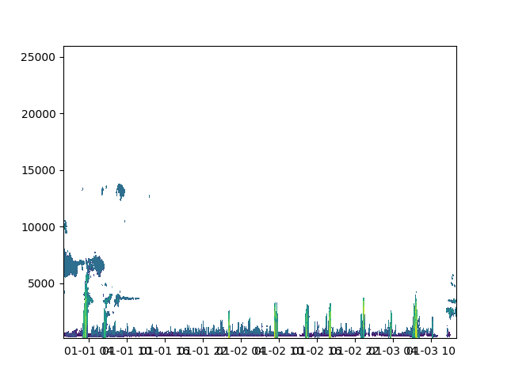
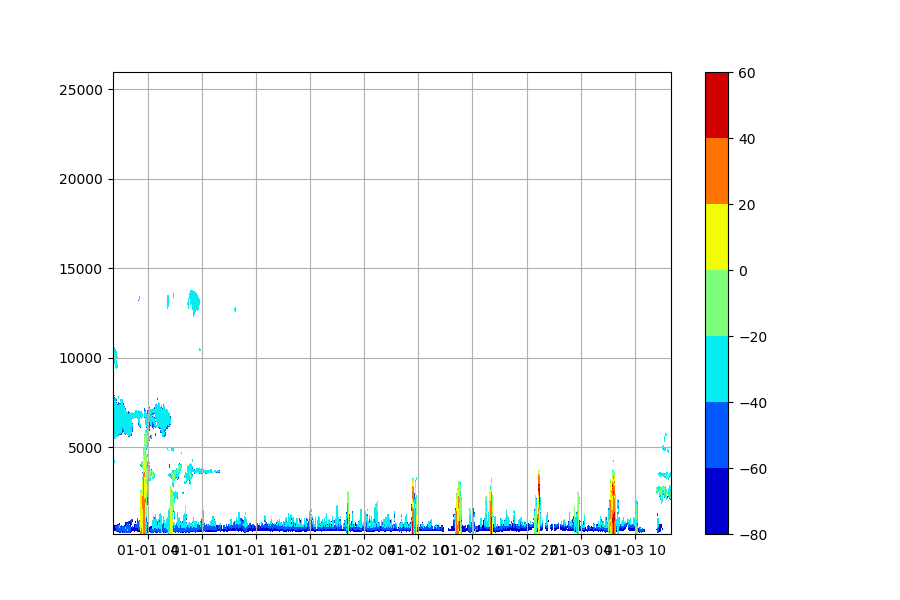

First Steps
===========

In this section I will try to cover some basics to work with this module.

Installation
------------
1. Download or clone this directory (green button upper right corner on github)
2. In a terminal navigate to the folder "BCO"
3. Run:

>>> python setup.py bdist_wheel
>>> pip install dist/BCO-?.?.?-py3-none-any.whl

   The ?`s needs to be replaced by the version number.

4. Check with "pip list" or "conda list" if it worked.

Documentation
-------------

The documentation is at the moment only available on linux machines.

To create the documentation:

1. In a terminal navigate to your downloaded folder "BCO"
2. cd into "docs"
3. Run:

>>> make html

   Please ignore all the warnings which occur under "checking consistency".

4. If it worked there should be a folder "generated" with some ".rst" files in it now.
    If not, you can remove the the files in generated again with running

    >>> make clean

5. cd into "\_build/html"
6. Open "index.html" with any browser

Tutorial
--------

Basics demonstrated on the Radar
^^^^^^^^^^^^^^^^^^^^^^^^^^^^^^^^

To work with the Radar class we need to import it:

>>> from BCO.Instruments import Radar

First we want to initiate the Radar class. We therefore only need to provide a timewindow with "start" and "end", for
which data will be used. Additionally we could change the Radar class from using Default: device="CORAL" to
device="KATRIN". To have a look at all parameters check the :class:`~BCO.Instruments.Radar.Radar` documentation.
In this example we will use the default CORAL data and therefore name our class "coral":

>>> coral = Radar(start="20180101", end="2018010315")

Now we have initiated an instance named "coral" which uses data from the 1st January 2018 00:00 UTC to the 3rd January
2018 15:00 UTC. Trailing Zeros do not need to be supplied.

Lets get started loading some data with this class using its methods. We want the timesteps,
the range and the reflectivity:

>>> coral_time = coral.getTime()
>>> coral_range = coral.getRange()
>>> coral_ref = coral.getReflectivity(postprocessing="Zu")

Mind that some methods have parameters. Most methods will have a default for their parameters, but it can be necessary
to change these defaults. Here for the reflectivity instead of the default "filtered reflectivity Zf" we have used
the "unfiltered reflectivity Zu".

We could now have a look at what data we have loaded by simply using matplotlib.pyplot:

>>> import matplotlib.pyplot as plt
>>> plt.contourf(coral_time, coral_range,coral_ref.transpose())

Another way to quickly have a look at the data from your instance is using the
:func:`~BCO.Instruments.Radar.Radar.quickplot2D` method of the Radar class:

>>> coral.quickplot2D(value=coral.getReflectivity(),save_name="test.png")

Methods are chainable with the instance of a class, which means that it is possible to load the data directly:

>>> coral_ref = Radar("20170723","20170723").getReflectivity()